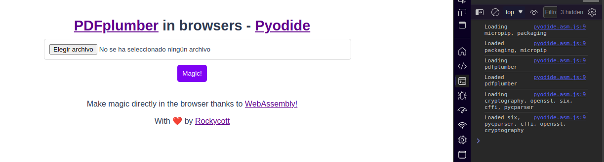
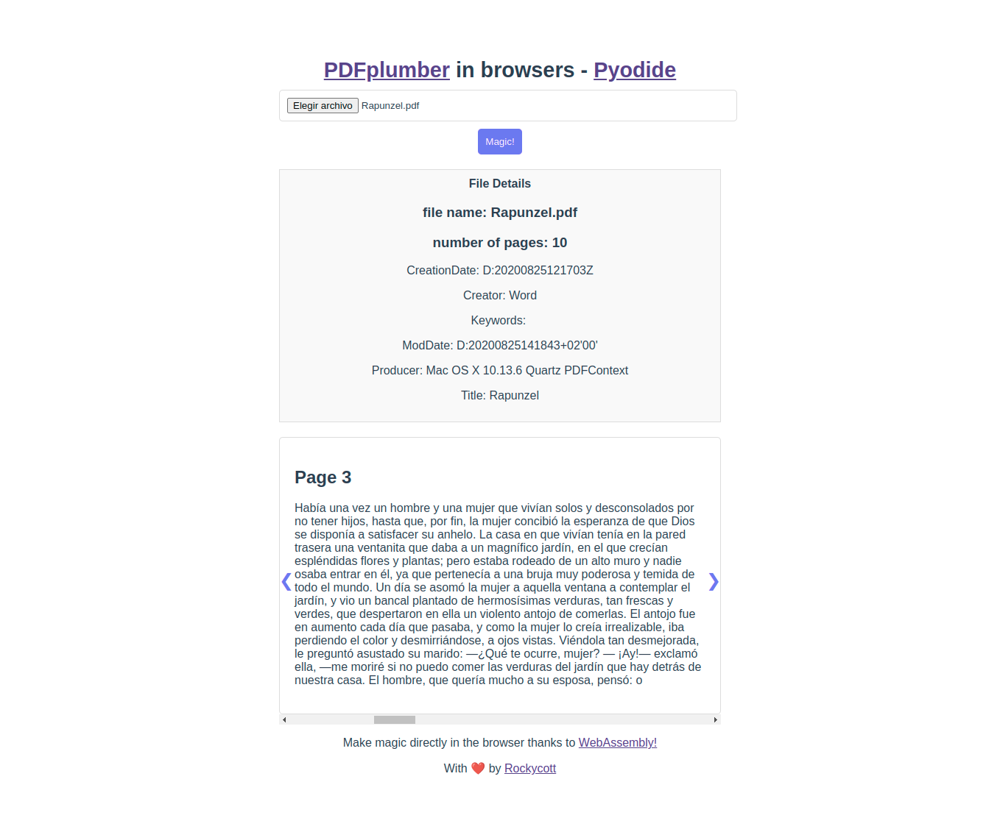

# PDFplumber-in-Browsers - Pyodide

Este proyecto demuestra cómo utilizar PDFplumber directamente en el navegador mediante Pyodide, aprovechando la potencia de WebAssembly.

### Características

- Sube un archivo PDF directamente desde tu navegador.
- Extrae texto de todas las páginas del PDF.
- Muestra detalles del archivo y metadatos.
- Construye un carrusel para visualizar el contenido de cada página.

### Cómo Probar

Ejecuta el archivo `index.html` ya sea abriéndolo en tu navegador o sirviéndolo con Live Server desde VSCode.

## Loading dependencies

## Loading PDF
